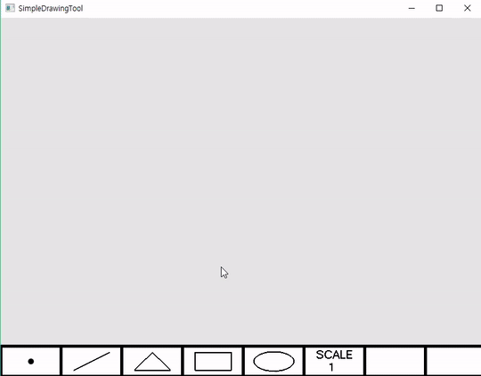

# SimpleDrawingTool  

__Program Introduction__  
* Very simple drawing tool working similar to MS PowerPoint   
* Mouse move, click and release to draw 

__Keyboard Control__   
* Select draw mode by Pressing key  
    'p' Point  
		'l' Line  
		't' Triangle  
		'q' Quad  
		'e' Ellipse  
	  '+' Point/Line Scale up  
	  '-' Point/Line Scale down  

* Select color mode by Pressing key  
	   'r' Red  
	   'g' Green  
	   'b' Blue  
	   'c' Cyan  
	   'm' Magenta  
	   'y' Yellow  
